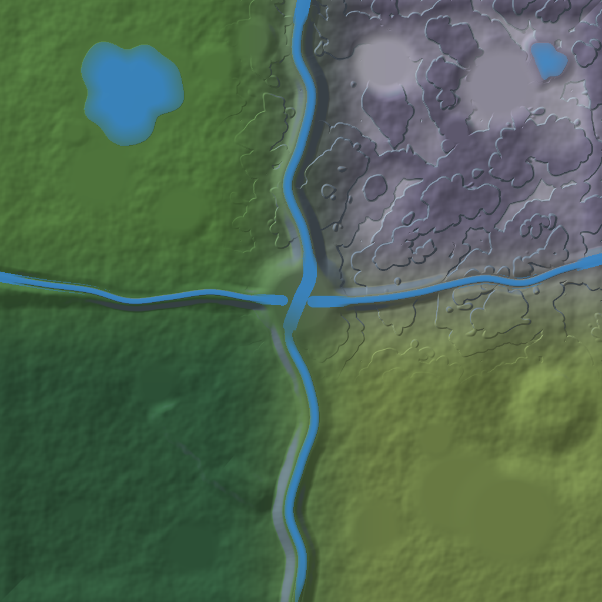

# Floresta de Vale Alto — mapa 3D low-poly 2 km × 2 km

Documento de design do mapa base do jogo. Estilo visual: **low-poly cartoon** no
padrão exato do kit de referência *Kenney Mini Forest 1.0* (CC0) — torres de
madeira, pontes de corda, plataformas elevadas com escadas, tendas azuis, alvos
de arco e flecha, pinheiros estilizados, rochas roxas e manchas de grama.

Tudo neste documento é **gerado e verificado por código**: `game/tools/gen_forest_map.py`
produz o heightmap, os mapas de material, o minimapa e o posicionamento de cada
uma das 17.423 instâncias. As coordenadas abaixo saem direto do JSON gerado.

---

## 1. Visão geral do mapa



| Parâmetro | Valor |
|---|---|
| Dimensões | **2000 m × 2000 m** (4 km², exatamente 2 km × 2 km) |
| Sistema de coordenadas | canto **sudoeste = (0, 0)**, nordeste = (2000, 2000). X cresce para leste, Z para norte, Y é altura |
| Faixa de altitude | codificada de 0 a 165 m; o terreno chega a **156 m** (Penhasco do Falcão) |
| Heightmap | 1024 × 1024, 16 bits (≈ 1,95 m por texel, 2,5 mm de precisão vertical) |
| Escala dos assets | 1 unidade do kit = **6 m**. Um pinheiro `tree` tem 10,1 m; `tree-high`, 13,7 m; um módulo de plataforma, 6 × 6 m; um andar de torre, 6 m |
| Marcos catalogados | **31** |
| Instâncias colocadas à mão (marcos) | 1.155 |
| Instâncias de vegetação/rocha procedural | 16.268 |
| Zonas | 4 quadrantes de **1 km² cada**, com transição suave de 620 m entre eles |

### Leitura do mapa em uma frase

Um rio corre de norte a sul pelo meio do mapa e dois afluentes correm de leste e
de oeste até encontrá-lo no centro exato (1000, 1000). Essa **cruz de água**
divide o terreno em quatro quadrantes de 1 km² — e as **cinco pontes de corda**
mais o hub central de plataformas elevadas são o que volta a costurá-los.

```
        (0,2000)                                        (2000,2000)
            ┌───────────────────┬───────────────────┐
            │                   │                   │
            │   ZONA A          │   ZONA B          │
            │   Vale das Tendas │   Planalto        │   ← norte
            │   ~29 m           │   das Torres      │
            │   lago, camp base │   53–156 m, mesas │
   Rio ────►│···· A8 ponte ·····│···· B8 ponte ·····│
   Prateado ├───────── H1 Cruz da Confluência ──────┤   (1000,1000)
   (N→S)    │···· D5 ponte ·····│···· D6 ponte ·····│
            │   ZONA C          │   ZONA D          │
            │   Mata Antiga     │   Campos de Treino│
            │   34–78 m, densa  │   13–54 m, aberta │
            │                   │   + pedreira      │
            └───────────────────┴───────────────────┘
        (0,0)                                          (2000,0)
```

### Variação de altura

| Elemento | Onde | Altura |
|---|---|---|
| Planalto em mesas (degraus com paredões verticais) | Zona B inteira | 53 → 156 m |
| Penhasco do Falcão (ponto culminante) | (1850, 1860) | **156 m** |
| Escarpa da Serra Velha (falésia contínua leste–oeste) | z ≈ 1000, de x=0 a x=900 | degrau de **27 m**, Zona C acima da Zona A |
| Ravina do Musgo (fenda) | (560,620) → (860,360) | **−26 m** abaixo do terreno |
| Pedreira Roxa (cratera de extração) | (1840, 640) | plataforma rochosa a 56 m, fundo a 22 m → paredes de **34 m** |
| Vale do Rio Prateado | x ≈ 1000, todo o eixo N–S | canal a 62 m no norte, 2 m no sul |
| Campos de Treino (região mais plana) | Zona D sul | 13 – 22 m |

### Hidrografia

| Curso d'água | Percurso | Largura | Perfil de altitude |
|---|---|---|---|
| **Rio Prateado** | (1010, 2000) → (985, 0), meandrando em torno de x=1000 | 30 m | 62 m → 2 m |
| **Ribeira do Falcão** | (2000, 1140) → confluência (1040, 998) | 22 m | 88 m → 30 m — inclui a **Cascata do Afluente** |
| **Córrego da Escarpa** | (0, 1080) → confluência (940, 1002) | 18 m | 52 m → 30 m, no fundo de uma garganta |
| **Lago Espelho** | centro (430, 1700), raio 165 m | 330 m Ø | superfície a 24 m, 7 m de profundidade |
| **Espelho do Falcão** | centro (1815, 1795), raio 62 m | 124 m Ø | superfície a 118 m (lago de altitude) |

### Iluminação, vento e material

- **Sol** a 46° de elevação, azimute 128°, cor `#fff3d6`; luz hemisférica céu `#a9d4ff` / solo `#6f8a52`.
  O visualizador permite varrer das 05:00 às 21:00, com o sol, a cor do céu e a névoa acompanhando.
- **Névoa** `#c9e6f5`, de 420 m a 2400 m — o que dá a profundidade de "cartão postal" ao horizonte.
- **Vento**: direção 240° (sudoeste), rajada de 0,45 de amplitude a 0,11 Hz.
  Aplicado no *vertex shader* a toda instância marcada `wind: true` no JSON
  (`tree`, `tree-high`, `plant`, `patch-grass`, `flag`, `tent`), com deslocamento
  ponderado pela altura acima da origem da instância — o tronco fica firme e a
  copa balança. Cada instância tem fase própria derivada da sua posição no mundo,
  então a floresta ondula em ondas, não em bloco.
- **Terreno em alta definição**: o `splatmap_2k.png` carrega 4 pesos de material
  (grama / terra-margem / rocha / musgo) e o *fragment shader* mistura essas
  camadas com ruído fBm em três frequências — o detalhe é procedural, então não
  há repetição de textura nem perda de nitidez por mais perto que a câmera chegue.

---

## 2. As quatro zonas

### Zona A — Vale das Tendas *(noroeste, 0–1000 × 1000–2000)*

**Altitude 21–57 m · relevo suave · a zona inicial.**

O vale mais aberto e mais claro do mapa. Colinas baixas de grama, bosques
espalhados de `tree` (o pinheiro médio) e um grande lago circular no norte.
É o quadrante feito para o jogador aprender: distâncias curtas entre marcos,
linha de visão longa, nenhum penhasco que mate.

O **Acampamento do Vale** (A1) é o hub inicial — oito tendas azuis em círculo
sobre terra batida, com um anel de pedras de fogueira no meio e um estandarte.
A 140 m dali, a **Torre de Vigia do Lago** (A2) sobe 18 m e olha para o **Lago
Espelho** (A3), 330 m de água parada a 24 m de altitude, com um **píer de
plataformas** (A4) avançando 42 m sobre a superfície.

O sul da zona termina abruptamente: a **Escarpa da Serra Velha** é um degrau de
27 m que corre de leste a oeste em z≈1000, com o **Córrego da Escarpa** correndo
no fundo da garganta. A única passagem é a **Ponte Suspensa da Escarpa** (A8),
128 m de corda a 30 m acima da água.

**Vegetação:** densidade média (célula de 15 m, 55% de ocupação), mistura 62%
`tree`, 18% `tree-high`, 12% `plant`, 8% `stones`.

---

### Zona B — Planalto das Torres *(nordeste, 1000–2000 × 1000–2000)*

**Altitude 53–156 m · a zona vertical · o marco visual do mapa.**

O quadrante mais alto e mais dramático. O terreno aqui é gerado com ruído
*ridged* terraceado em quatro degraus, o que produz **mesas de topo plano com
paredões verticais** — a leitura clássica de penhasco low-poly, com rocha roxa
exposta nas encostas.

A **Grande Torre de Vigia** (B1) é o ponto de referência de todo o mapa: quatro
andares, 24 m de estrutura de madeira até o deque, telhado azul e bandeira, a
108 m de altitude — visível de qualquer canto do mapa. Ao lado, a **Fortaleza
Suspensa** (B2) é uma rede de deques a 18 m e 24 m do chão ligados por ponte de
corda, com torre de guarda e escadas: 115 instâncias, a segunda estrutura mais
complexa do mapa.

O **Penhasco do Falcão** (B3) é o ponto culminante, 156 m, com o pequeno **Espelho
do Falcão** (B7) encaixado na mesa a 118 m. A oeste, a **Ribeira do Falcão**
despenca do planalto na **Cascata do Afluente** (B4) — 88 m de altitude na borda
leste do mapa, 30 m na confluência central.

Subir aqui é parte do design: a **Escadaria da Rocha** (B6) — nove rampas
`rocks-ramp` mais escadas de madeira — é a rota a pé do vale central para o topo.

**Vegetação:** esparsa (célula de 18 m, 46%), 34% `tree-high` nas bordas,
26% `tree`, 30% rochas (`rocks-low` + `rocks-high`) — o planalto é pedra, não mata.

---

### Zona C — Mata Antiga *(sudoeste, 0–1000 × 0–1000)*

**Altitude 34–78 m · a zona fechada · pouca visibilidade.**

A floresta de verdade. Densidade de espalhamento **quase o dobro** de qualquer
outra zona (célula de 11 m, 88% de ocupação, 58% `tree-high`), com o canal de
musgo do splatmap escurecendo o solo — o quadrante inteiro lê como sub-bosque
sombrio, o contraponto do Vale das Tendas.

O **Bosque Denso** (C1) é o núcleo: 42 pinheiros altos com copas sobrepostas.
As **Ruínas da Clareira** (C2) abrem um buraco nessa massa — seis pilares de
madeira em círculo, três ainda com deque em pé. A **Ravina do Musgo** (C3) corta
a mata em diagonal, 26 m de profundidade, atravessada por uma ponte de corda de
110 m em diagonal.

A **Trilha das Lanternas** (C5) é a espinha de navegação da zona: 780 m de trilha
cercada com estandartes, ligando a Ponte da Escarpa (A8) no noroeste até a Ponte
Baixa (D5) no leste. Sem ela, a mata é fácil de se perder — o que é intencional.

No canto oeste, as **Pedras Roxas** (C7) marcam o flanco da Escarpa com um
afloramento escalável.

---

### Zona D — Campos de Treino *(sudeste, 1000–2000 × 0–1000)*

**Altitude 13–54 m · a zona aberta · o campo de arco e flecha.**

O quadrante mais plano e mais claro, feito para combate à distância e para
espaço de manobra. Prados amplos com bosques isolados, exatamente o oposto da
Mata Antiga do outro lado do rio.

A **Arena de Arqueria** (D1) é o marco funcional: oito alvos alinhados a 46 m da
linha de tiro, arena cercada de 136 × 72 m, bandeiras nos quatro cantos e três
arqueiros de referência com arcos. Logo atrás, a **Plataforma de Comando** (D2)
levanta um deque coberto a 12 m para o instrutor.

A **Vila das Tendas Azuis** (D3) é o maior assentamento do mapa: 15 tendas em dois
círculos, cerca longa de 200 m e torre de vigia — 85 instâncias.

O contraste de relevo vem da **Pedreira Roxa** (D4): uma plataforma rochosa
elevada a 56 m com uma cratera de 330 m escavada no meio, fundo a 22 m, paredes
de 34 m, blocos roxos espalhados e uma rampa de saída a noroeste. É o único
lugar da Zona D onde se pode ficar acima da linha do horizonte.

O **Campo das Bandeiras** (D7) — doze estandartes em anel em campo aberto — é o
ponto natural de reagrupamento ou de captura.

---

### Como as quatro zonas se conectam

| Ligação | Marco | Coordenada | Tipo |
|---|---|---|---|
| A ↔ B | **B8 · Ponte do Vau** | (1000, 1520) | ponte de corda de 80 m sobre o Rio Prateado, deque a 65–69 m |
| A ↔ C | **A8 · Ponte Suspensa da Escarpa** | (430, 1000) | 128 m sobre a garganta, deque a 69–74 m |
| C ↔ D | **D5 · Ponte Baixa das Pedras** | (1010, 430) | 104 m com vau de pedras ao lado, deque a 30–33 m |
| B ↔ D | **D6 · Ponte do Afluente** | (1560, 1060) | 116 m sobre a Ribeira do Falcão, deque a 85–88 m |
| todas | **H1 · Cruz da Confluência** | (1000, 1000) | deque central de 30 × 30 m a 24 m de altura, quatro torres nos cantos e quatro pontes irradiando |

O hub central H1 é a estrutura mais complexa do mapa (158 instâncias) e está
exatamente sobre o encontro dos três cursos d'água. Ele é o destino natural de
qualquer rota entre duas zonas.

---

## 3. Lista de marcos com coordenadas

`(X, Z)` no plano 0–2000. `Y` é a altitude do terreno no ponto — para os marcos
de água, é a altura do **leito**; a superfície está na tabela de hidrografia.

| ID | Marco | Zona | (X, Z) | Y | Tipo | Instâncias |
|---|---|---|---|---|---|---|
| **H1** | **Cruz da Confluência** | centro | **(1000, 1000)** | 26 m | hub | 158 |
| A1 | Acampamento do Vale | A | (330, 1420) | 25 m | acampamento | 58 |
| A2 | Torre de Vigia do Lago | A | (250, 1560) | 20 m | torre | 14 |
| A3 | Lago Espelho | A | (430, 1700) | 17 m | água | — |
| A4 | Píer de Madeira | A | (560, 1640) | 23 m | plataforma | 33 |
| A5 | Campo de Tiro do Novato | A | (600, 1300) | 27 m | alvos | 24 |
| A6 | Círculo de Pedras | A | (720, 1780) | 30 m | ruína | 11 |
| A7 | Posto Avançado Norte | A | (840, 1870) | 44 m | plataforma | 36 |
| A8 | Ponte Suspensa da Escarpa | A | (430, 1000) | 32 m | ponte | 33 |
| B1 | Grande Torre de Vigia | B | (1520, 1560) | 108 m | torre | 28 |
| B2 | Fortaleza Suspensa | B | (1660, 1720) | 130 m | plataforma | 115 |
| B3 | Penhasco do Falcão | B | (1850, 1860) | 128 m | penhasco | 31 |
| B4 | Cascata do Afluente | B | (1400, 1080) | 82 m | água | 19 |
| B5 | Acampamento do Planalto | B | (1280, 1790) | 136 m | acampamento | 42 |
| B6 | Escadaria da Rocha | B | (1300, 1400) | 123 m | caminho | 20 |
| B7 | Espelho do Falcão | B | (1815, 1795) | 114 m | água | — |
| B8 | Ponte do Vau | B | (1000, 1520) | 39 m | ponte | 20 |
| C1 | Bosque Denso | C | (300, 620) | 69 m | floresta | 43 |
| C2 | Ruínas da Clareira | C | (520, 720) | 67 m | ruína | 18 |
| C3 | Ravina do Musgo | C | (700, 470) | 43 m | ponte | 35 |
| C4 | Torre Caçadora | C | (250, 300) | 78 m | torre | 12 |
| C5 | Trilha das Lanternas | C | (700, 700) | 60 m | caminho | 63 |
| C6 | Clareira dos Alvos Ocultos | C | (640, 180) | 76 m | alvos | 28 |
| C7 | Pedras Roxas | C | (150, 850) | 59 m | penhasco | 23 |
| D1 | Arena de Arqueria | D | (1520, 360) | 15 m | alvos | 68 |
| D2 | Plataforma de Comando | D | (1450, 540) | 15 m | plataforma | 23 |
| D3 | Vila das Tendas Azuis | D | (1700, 280) | 13 m | acampamento | 85 |
| D4 | Pedreira Roxa | D | (1840, 640) | 22 m | penhasco | 41 |
| D5 | Ponte Baixa das Pedras | D | (1010, 430) | 12 m | ponte | 30 |
| D6 | Ponte do Afluente | D | (1560, 1060) | 67 m | ponte | 30 |
| D7 | Campo das Bandeiras | D | (1250, 250) | 20 m | ruína | 14 |

### Checklist dos elementos obrigatórios da referência

| Elemento pedido | Onde aparece |
|---|---|
| Torres de vigia de madeira | A2, B1, B2, C4, H1 (×4), + torres de apoio em A7, B3, B5, D3, D4 — **15 torres** |
| Pontes de corda | A8, B8, C3, D5, D6, B1↔auxiliar, B2 interno, H1 (×4) — **11 travessias** |
| Plataformas elevadas com escadas | A4, A7, B2, D2, H1, C2 (ruína) |
| Tendas azuis | A1 (8), B5 (6), D3 (15), + tendas isoladas em A7, B2, C4 — **32 tendas** |
| Alvos de tiro ao arco | A5 (4), C6 (5), D1 (8), + alvos isolados em C4 e D7 — **19 alvos** |
| Grupos de pinheiros | 7.238 árvores (`tree` + `tree-high`), com C1 como bosque de referência |
| Rochas roxas | C7, D4, B3, + 750 rochas espalhadas |
| Clareiras | A6, C2, C6, D7 e as clareiras procedurais criadas pelo ruído de agrupamento |

---

## 4. Organização dos assets para uma engine 3D

```
game/
├── assets/
│   ├── LICENSE-kenney.txt          # CC0 — Kenney Mini Forest 1.0
│   ├── models/
│   │   ├── nature/                 # tree, tree-high, plant, patch-grass,
│   │   │   ├── Textures/           #   patch-dirt, stones, rocks-low,
│   │   │   └── *.glb               #   rocks-high, rocks-ramp
│   │   ├── structures/             # building-structure, building-platform,
│   │   │   ├── Textures/           #   building-roof, platform, ladder,
│   │   │   └── *.glb               #   bridge, fence, flag
│   │   ├── props/                  # tent, target
│   │   ├── characters/             # character-archer
│   │   └── weapons/                # weapon-bow, weapon-arrow
│   ├── textures/
│   │   ├── colormap.png            # 512² — atlas de paleta compartilhado por todos os modelos
│   │   ├── heightmap_2k.png        # 1024² greyscale 16-bit, 0–165 m — importar em engine
│   │   ├── heightmap_2k.u16.bin    # mesmos dados, u16 little-endian, para leitura direta
│   │   ├── splatmap_2k.png         # RGBA = grama / terra / rocha / musgo
│   │   └── minimap_2k.png          # preview sombreado, norte para cima
│   └── source/kenney-reference.png # imagem de referência do estilo
├── data/
│   ├── forest_map_2k.json          # mundo, zonas, rios, lagos, 31 marcos, 1.155 estruturas
│   └── forest_map_2k.scatter.json  # 16.268 instâncias em arrays compactos por modelo
├── tools/                          # o gerador (Python 3, só stdlib)
│   ├── gen_forest_map.py           # ponto de entrada
│   ├── terrain.py                  # campo de altura, zonas, rios, escarpa
│   ├── landmarks.py                # os 31 marcos, escritos à mão
│   ├── kit.py                      # escala e peças compostas (torre, ponte, acampamento…)
│   ├── noise.py                    # Perlin / fBm / ridged determinístico
│   └── pngwrite.py                 # encoder PNG sem dependências
├── viewer/                         # visualizador three.js (WebGL)
└── docs/MAP_DESIGN.md              # este documento
```

### Convenções de nomenclatura

| Regra | Exemplo |
|---|---|
| Modelos: `kebab-case`, nome do kit preservado | `building-platform.glb` |
| Pastas: por **função**, não por tipo de arquivo | `structures/`, não `glb/` |
| Cada pasta de modelos carrega seu próprio `Textures/colormap.png` | o caminho relativo dentro do `.glb` é `Textures/colormap.png`, então a pasta é auto-contida e pode ser importada isoladamente |
| Marcos: `<zona><n>` | `B2`, `D5`, `H1` |
| Cursos d'água: `kebab-case` sem acento | `rio-prateado`, `ribeira-falcao` |
| Dados gerados: `<mapa>_<resolução>.<uso>.<ext>` | `forest_map_2k.scatter.json` |

### Como cada campo do JSON entra na engine

```jsonc
// forest_map_2k.json → structures[]
{
  "model": "building-platform",   // arquivo: assets/models/<group>/<model>.glb
  "group": "structures",
  "pos":   [1000.0, 50.82, 1000.0],  // metros, Y já resolvido contra o heightmap
  "ry":    0.0,                      // rotação em torno de Y, em GRAUS
  "scale": 6.0,                      // uniforme; 6.0 = escala nativa do mapa
  "tilt":  0.0,
  "wind":  false,                    // true → aplicar o shader de vento
  "landmark": "H1"                   // para agrupar/streaming por marco
}

// forest_map_2k.scatter.json → layers[]
{
  "model": "tree-high", "group": "nature", "wind": true,
  "stride": 5, "format": ["x","y","z","ry_deg","scale"],
  "count": 3986,
  "data": [ 12.4, 71.2, 638.9, 214.7, 7.31,  /* … */ ]
}
```

### Pipeline recomendado por engine

- **Unity** — importar `heightmap_2k.png` como RAW/16-bit no Terrain (resolução
  1025, tamanho 2000 × 165 × 2000). Ler os dois JSON num `ScriptableObject` e
  instanciar as camadas de scatter como `Graphics.DrawMeshInstanced` (limite de
  1023 por lote) ou como *Terrain Details*. O `splatmap_2k.png` vira os pesos
  das quatro `TerrainLayers`.
- **Unreal** — `heightmap_2k.png` importa direto como Landscape (1009×1009 é a
  resolução compatível mais próxima; reamostrar ou usar 2017×2017 com o mapa
  em 2× resolução). As camadas de scatter viram `Hierarchical Instanced Static
  Mesh` por modelo. O vento sai de `SimpleGrassWind` no material.
- **Godot 4** — `HeightMapShape3D` a partir do `.u16.bin`, `MultiMeshInstance3D`
  por camada, e o mesmo shader de vento aplicado no `vertex()`.
- **three.js** — já implementado em `game/viewer/`, com `InstancedMesh` dividido
  em blocos de 250 m para *frustum culling* e corte por distância.

### Estratégia de instanciamento

O visualizador divide cada camada em blocos de **250 m × 250 m** (8 × 8 sobre o
mapa) e cria um `InstancedMesh` por par *(modelo, bloco)*. Isso dá a cada malha
uma esfera envolvente justa, o que faz o *frustum culling* funcionar de verdade
num mapa deste tamanho e permite cortar por distância de desenho sem reconstruir
buffers. Com 17.423 instâncias o resultado são ~120 *draw calls* visíveis por
quadro em vez de 17 mil.

---

## Reprodutibilidade

```bash
python3 game/tools/gen_forest_map.py      # ~80 s, só stdlib, sem numpy
```

O gerador é determinístico (semente `20260901`): a mesma entrada produz os mesmos
bytes. Todo posicionamento é feito contra o heightmap **já quantizado em 16 bits**,
que é o mesmo que a engine vai carregar — então nenhum prop flutua ou afunda por
diferença de amostragem. A verificação automática confirma **0 instâncias com
geometria visível abaixo do terreno**.

---

*Assets: [Kenney Mini Forest 1.0](https://kenney.nl) — licença CC0, uso comercial livre.*
